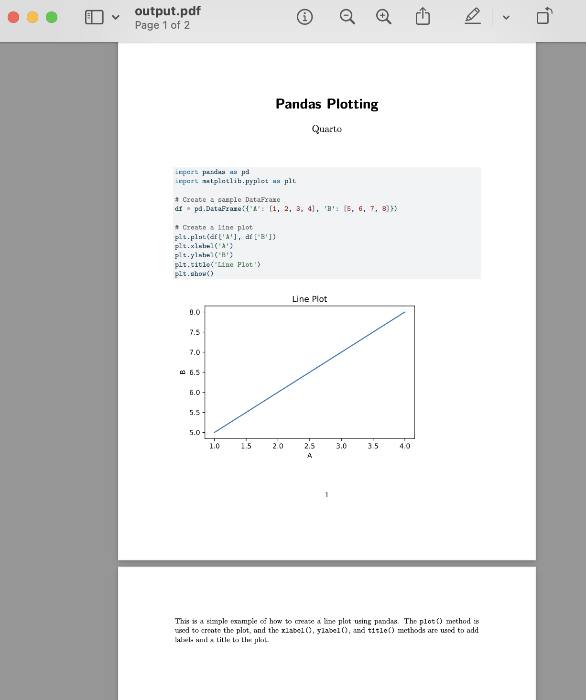

# quarto-agent

A Google GenAI Agent that iterates creation and rendering of [Quarto artefacts](https://quarto.org/).

Uses a while loop and [Google GenAI function calling](https://ai.google.dev/gemini-api/docs/function-calling/tutorial?lang=python).

The idea is to have something similar to [Anthropic's Artifacts](https://support.anthropic.com/en/articles/9487310-what-are-artifacts-and-how-do-i-use-them) but using Quarto since its got a lot more formats, so the next step is to serve up the files that are stored on Google Cloud Storage to the user in the browser.  

[Chainlit](https://chainlit.io/) is good with PDFs for example:


## Examples

Launching the Flask app then querying it with curl for demo, but it is intended to be queried from other agents in the [Multivac system](https://dev.sunholo.com/) who want Quarto files created.

```bash
curl -X POST ${FLASK_URL}/vac/streaming/quarto_test \
  -H "Content-Type: application/json" \
  -d '{
    "user_input": "Please create a Quarto render that will demonstrate a plot showing off pandas plotting along with some markdown explaining what is happening"
}'
```

Creates and uploads to bucket:


Adjust to render a PDF:

```bash
curl -X POST ${FLASK_URL}/vac/streaming/quarto_test \
  -H "Content-Type: application/json" \
  -d '{
    "user_input": "Please create a Quarto render that will demonstrate a plot showing off pandas plotting along with some markdown explaining what is happening.  Render it as a PDF"
}'
```

Oops - tinytext wasn't installed.  So agent downloads it:

```
270.0MB\u001b[2K\u001b[G\nDownloading TinyTex v2024.07.03 [################################## ] 270.0MB\u001b[2K\u001b[G\nDownloading TinyTex v2024.07.03 [################################## ] 270.0MB\u001b[2K\u001b[G\nDownloading TinyTex v2024.07.03 ...

u001b[2K\u001b[G\n[\u2713] Downloading TinyTex v2024.07.03\n\n(|) Unzipping TinyTeX-v2024.07.03.tgz\n(/) Unzipping TinyTeX-v2024.07.03.tgz\n(-) Unzipping TinyTeX-v2024.07.03.tgz\n(\\) Unzipping TinyTeX-v2024.07.03.tgz\n(|) Unzipping TinyTeX-v2024.07.03.tgz\n(/) Unzipping TinyTeX-v2024.07.03.tgz\n(-) Unzipping TinyTeX-v2024.07.03.tgz\n(\\) Unzipping TinyTeX-v2024.07.03.tgz\n...

 Setting default repository\u001b[2K\u001b[G\n[\u2713] Default Repository: https://mirrors.dotsrc.org/ctan/systems/texlive/tlnet/\nInstallation successful\n"}
```

Agent completes the task:

```
--- function call: render_and_upload_quarto({"format": "pdf", "markdown_filename": "renders/temp.py"}) ---
 - result:
{"status": "success", "gcs_urls": ["gs://multivac-internal-dev-dev-llmops-bucket/quarto/quarto_test/renders/20240821-152619/temp.py", 

...

 This is XeTeX, Version 3.141592653-2.6-0.999996 (TeX Live 2024) (preloaded format=xelatex)\n   restricted \\write18 enabled.\n  entering extended mode\n  \n\nOutput created: output.pdf\n\n"}


STOPPING: The user asked for a PDF render of a Quarto document with a pandas plot and markdown.  The agent has successfully rendered and uploaded the document.
```



Lets make it a Powerpoint (Keynote) instead:

```bash
curl -X POST ${FLASK_URL}/vac/streaming/quarto_test \
  -H "Content-Type: application/json" \
  -d '{
    "user_input": "Please create a Quarto .py file that will demonstrate pandas plotting along with some markdown explaining what is happening. Render the file as a Powerpoint."
}'
```


## Install

1. Clone repo
1. Install Quarto: https://quarto.org/docs/get-started/
1. Create a `.venv` in your favourite manner.
1. Install Sunholo `pip install sunholo[gcp,http]>=0.86.1`

Start Flask app locally

```bash
cd quarto
python app
```

Deploy to Multivac server to have Quarto agent available for other agents to make [PDFs, HTML pages, Powerpoint, etc.](https://quarto.org/docs/output-formats/all-formats.html)

## GenAIFunctionProcessor Class

The sunholo `GenAIFunctionProcessor` class takes functions for google genai library and executes them. It was originally created for database agents such as `AlloyDB` but its flexible enough to be used for other agents.

You inherit from the class then define the function tools the agent can execute in a `construct_tools` method.

A useful utility function to have is `decide_to_go_on()` which you can signal in a loop you are finished and want to stop.

I want the files to be on Google Cloud Storage so I can serve them up to the user application, so the render function also uploads to there.

```python
...
from sunholo.genai import GenAIFunctionProcessor
...

class QuartoProcessor(GenAIFunctionProcessor):

    def upload_to_gcs(self, folder:str):
        log.info(f"Uploading {folder=}")
        vector_name = self.config.vector_name

        output_urls = []
        # Iterate through all files in the directory and upload them
        for root, _, files in os.walk(folder):
            for file in files:
                filename = os.path.join(root, file)

                # Create a relative path for the bucket
                relative_path = os.path.relpath(filename, folder)
                bucket_filepath = f"quarto/{vector_name}/{folder}/{relative_path}"

                file_url = add_file_to_gcs(filename,
                                           vector_name=vector_name,
                                           metadata={"type": "quarto"},
                                           bucket_filepath=bucket_filepath)
        
                log.info(f"Uploaded {filename} to {file_url=}")
                output_urls.append(file_url)

        return output_urls
        
    def construct_tools(self) -> dict:
        #tools = self.config.vacConfig("tools")
        #if not tools:
        #    vac_name = self.config.vector_name
        #    raise ValueError(f"No config.vac.{vac_name}.tools found")
        #quarto_config = tools.get("quarto")

        def write_to_file(text: str, file_path: str = "renders/temp.py") -> str:
            """
            Writes the given markdown content to a specified file.

            Args:
                text (str): The text content to write to the file.
                file_path (str): The path to the file where the markdown will be written. 
                                Default is "renders/temp.py".

            Returns:
                str: The path to the file where the text was written.
            """
            try:
                # Ensure the directory exists
                os.makedirs(os.path.dirname(file_path), exist_ok=True)

                # ensures \n gets rendered correctly
                text = text.encode('utf-8').decode('unicode_escape')

                # Write the markdown content to the file
                with open(file_path, 'w', encoding='utf-8') as file:
                    file.write(text)
                
                # Log the successful write operation
                print(f"Text successfully written to {file_path}")
                return file_path

            except Exception as e:
                log.error(f"Error writing markdown to file: {str(e)}")
                raise

        def render_and_upload_quarto(markdown_filename: str = "", format: str='html') -> dict:
            """
            Render and upload a Quarto markdown document to Google Cloud Storage.

            This function expects a filename location of valid Quarto markdown. 
            The encoded markdown will be rendered using Quarto. 
            The resulting output file will be uploaded to a Google Cloud Storage (GCS) bucket.
            The markdown must be quarto formatted to work with quarto.
            The markdown will be supplied to the quarto_cmd() function and execute `quarto render temp.qmd --to={format} --output={filename}`
            If successfully rendered, the output file will then be uploaded to a GCS bucket
            
            Args:
                markdown_filename (str): The location of the markdown file to render. If not provided, a demo markdown file will be used.
                format (str): The format to render the markdown file into - default is 'html'.
            Returns:
                dict: A dictionary with the result of the rendering process, including:
                    - "status": "success" or "error" depending on the outcome.
                    - "gcs_url": The URL of the uploaded file (if successful).
                    - "stdout": The standard output from the Quarto rendering process.
                    - "stderr": The standard error output from the Quarto rendering process.
                    - "message": An error message if the rendering or upload failed.
            """

            if not markdown_filename:
                markdown_filename = 'tools/demo.qmd'

            try:               
                # Create a timestamped directory
                timestamp = time.strftime("%Y%m%d-%H%M%S")
                temp_dir = os.path.join("renders", timestamp)
                os.makedirs(temp_dir, exist_ok=True)

                # Copy the markdown file to the timestamped directory
                new_markdown_filename = os.path.join(temp_dir, os.path.basename(markdown_filename))
                shutil.copy(markdown_filename, new_markdown_filename)

                # Render the markdown file using Quarto from the new directory
                output_filename = f'output.{format}'
                render_command = f"render {os.path.basename(new_markdown_filename)} --to={format} --output={output_filename}"
                result = quarto_command(render_command, cwd=temp_dir)
                result = json.loads(result)
                log.info(f"{result=}")

                # Check if there was an error during rendering
                if result["status"] == "error":
                    return json.dumps({
                        "status": "error",
                        "stdout": result["stdout"],
                        "stderr": result["stderr"],
                        "message": "Quarto rendering failed."
                    })
                
                # Upload the rendered file to Google Cloud Storage
                upload_to_gcs = self.upload_to_gcs(temp_dir)
                
                return json.dumps({
                    "status": "success",
                    "gcs_urls": upload_to_gcs,
                    "stdout": result["stdout"],
                    "stderr": result["stderr"]
                })
            
            except Exception as e:
                error_message = f"Error in render_and_upload_quarto: {str(e)}"
                traceback_details = traceback.format_exc()
                error_and_traceback = f"ERROR: {error_message} {traceback_details}"
                log.warning(error_and_traceback)
                return json.dumps({
                    "status": "error",
                    "message": error_and_traceback,
                })
        
        def decide_to_go_on(go_on: bool, chat_summary: str) -> dict:
            """
            Examine the chat history.  If the answer to the user's question has been answered, then go_on=False.
            If the chat history indicates the answer is still being looked for, then go_on=True.
            If there is no chat history, then go_on=True.
            If there is an error that can't be corrected or solved by you, then go_on=False.
            If there is an error but you think you can solve it by correcting your function arguments (such as an incorrect source), then go_on=True
            If you want to ask the user a question or for some more feedback, then go_on=False.
            When calling, please also add a chat summary of why you think the function should  be called to end.
            
            Args:
                go_on: boolean Whether to continue searching for an answer
                chat_summary: string A brief explanation on why go_on is TRUE or FALSE
            
            Returns:
                boolean: True to carry on, False to continue
            """
            return {"go_on": go_on, "chat_summary": chat_summary}
        
        def quarto_command(cmd: str, cwd: str = None) -> dict:
            """
            Run a Quarto command in the terminal and capture the output.
            Do not run commands starting with 'quarto' e.g. 'quarto preview' - instead use 'preview'.
            The 'quarto' command will be prefixed to your cmd.
            
            Args:
                cmd (str): The command to execute with Quarto (e.g., 'check', 'render <file>').
                cwd (str): The working directory in which to run the command. Default is None, 
                   which means the command runs in the current working directory.        
            Returns:
                dict: A dictionary containing 'stdout' and 'stderr' from the command execution.
                    If the command is successful (return code 0), 'status' will be 'success',
                    even if there is content in 'stderr'.
            """
            try:
                result = subprocess.run(
                            ["quarto"] + cmd.split(), 
                            capture_output=True, 
                            text=True, 
                            cwd=cwd
                        )
                log.info(f"{result.stdout=}")
                log.info(f"{result.stderr=}")

                if result.returncode == 0:
                    # Command was successful
                    return json.dumps({
                        "status": "success",
                        "stdout": result.stdout,
                        "stderr": result.stderr
                    })
                else:
                    # Command failed
                    return json.dumps({
                        "status": "error",
                        "stdout": result.stdout,
                        "stderr": result.stderr,
                        "message": f"Quarto command '{cmd}' failed with return code {result.returncode}",
                        "returncode": result.returncode
                    })
                
            except Exception as e:
                return json.dumps({
                    "status": "error",
                    "stdout": "",
                    "stderr": f"Error running Quarto command '{cmd}': {str(e)}"
                })
        
        def quarto_version() -> str:
            """
            Reports back the version of Quarto available and what is installed on the server.
            If the result starts with "OK:" then quarto is successfully installed.
            There may be other dependencies thought that are not installed such as R or Jupyter.
            
            Returns:
                str: The version information of Quarto, as returned by the 'quarto check' command.
            """
            result = quarto_command("check")
            result = json.loads(result)

            if result["status"] == "success":
                return f"OK: {result['stderr']}"
            return result["stdout"]

        def install_pip_package(package_name: str) -> dict:
            """
            Install a pip package in the local environment.
            
            Args:
                package_name (str): The name of the pip package to install.
            
            Returns:
                dict: A dictionary containing 'stdout' and 'stderr' from the command execution.
            """
            try:
                result = subprocess.run(["pip", "install", package_name], capture_output=True, text=True)

                log.info(f"Installing package {package_name}")
                log.info(f"{result.stdout=}")
                log.info(f"{result.stderr=}")

                return json.dumps({
                    "stdout": result.stdout,
                    "stderr": result.stderr
                })
            
            except Exception as e:
                return json.dumps({
                    "stdout": "",
                    "stderr": f"Error installing pip package '{package_name}': {str(e)}"
                })

        def install_r_package(package_name: str) -> dict:
            """
            Install an R package in the local environment.
            
            Args:
                package_name (str): The name of the R package to install.
            
            Returns:
                dict: A dictionary containing 'stdout' and 'stderr' from the command execution.
            """
            try:
                # Construct the R command to install the package
                r_command = f"install.packages('{package_name}', repos='https://cloud.r-project.org/')"
                
                # Run the R command
                result = subprocess.run(["R", "-e", r_command], capture_output=True, text=True)

                log.info(f"Installing R package {package_name}")
                log.info(f"{result.stdout=}")
                log.info(f"{result.stderr=}")

                return json.dumps({
                    "stdout": result.stdout,
                    "stderr": result.stderr
                })
            
            except Exception as e:
                return json.dumps({
                    "stdout": "",
                    "stderr": f"Error installing R package '{package_name}': {str(e)}"
                    })


        return {
            "render_and_upload_quarto": render_and_upload_quarto,
            "quarto_command": quarto_command,
            "quarto_version": quarto_version,
            "decide_to_go_on": decide_to_go_on,
            "install_pip_package": install_pip_package,
            "install_r_package": install_r_package,
            "write_to_file": write_to_file,
        }
```

## Agent loop

The [`quarto/vac_service.py`](quarto/vac_service.py) script contains a loop that uses the tools.  Work in progress but it works ok as is.

## Examples using curl

> TIP: Passing around markdown in HTTP is a really bad idea as it gets into escape chaarcter hell, pass files instead if possible.

```bash
export FLASK_URL=http://127.0.0.1:8080

curl -X POST ${FLASK_URL}/vac/streaming/quarto_test \
  -H "Content-Type: application/json" \
  -d '{
    "user_input": "Report if quarto is working"
}'
```

```bash
----Loop [0]------
# quarto_version({}) result:
OK: 

[✓] Checking versions of quarto binary dependencies...
      Pandoc version 3.1.1: OK
      Dart Sass version 1.55.0: OK

[✓] Checking versions of quarto dependencies......OK

[✓] Checking Quarto installation......OK
      Version: 1.3.450
      Path: /Applications/quarto/bin


(|) Checking basic markdown render....
(/) Checking basic markdown render....
(-) Checking basic markdown render....
(\) Checking basic markdown render....

[✓] Checking basic markdown render....OK


(|) Checking Python 3 installation....
(/) Checking Python 3 installation....

[✓] Checking Python 3 installation....OK
      Version: 3.12.3
      Path: /Users/mark/dev/sunholo/quarto-agent/.venv/bin/python3
      Jupyter: 5.7.2
      Kernels: python3


(|) Checking Jupyter engine render....
(/) Checking Jupyter engine render....
(-) Checking Jupyter engine render....
(\) Checking Jupyter engine render....
(|) Checking Jupyter engine render....
(/) Checking Jupyter engine render....
(-) Checking Jupyter engine render....
(\) Checking Jupyter engine render....
(|) Checking Jupyter engine render....
(/) Checking Jupyter engine render....
(-) Checking Jupyter engine render....
(\) Checking Jupyter engine render....
(|) Checking Jupyter engine render....
(/) Checking Jupyter engine render....
(-) Checking Jupyter engine render....
(\) Checking Jupyter engine render....
(|) Checking Jupyter engine render....
(/) Checking Jupyter engine render....
(-) Checking Jupyter engine render....
(\) Checking Jupyter engine render....

[✓] Checking Jupyter engine render....OK


(|) Checking R installation...........
(/) Checking R installation...........

[✓] Checking R installation...........OK
      Version: 4.2.1
      Path: /Library/Frameworks/R.framework/Resources
      LibPaths:
        - /Users/mark/Library/R/x86_64/4.2/library
        - /Library/Frameworks/R.framework/Versions/4.2/Resources/library
      knitr: 1.40
      rmarkdown: 2.17


(|) Checking Knitr engine render......
(/) Checking Knitr engine render......
(-) Checking Knitr engine render......
(\) Checking Knitr engine render......
(|) Checking Knitr engine render......
(/) Checking Knitr engine render......
(-) Checking Knitr engine render......

[✓] Checking Knitr engine render......OK


----Loop [0] End------

----Loop [1]------


STOPPING: Quarto is installed and working
```

Do the demo.qmd:

```bash
curl -X POST ${FLASK_URL}/vac/streaming/quarto_test \
  -H "Content-Type: application/json" \
  -d '{
    "user_input": "Please render the demo Quarto page"
}'
----Loop [0]------
# render_and_upload_quarto({}) result:
{"status": "success", "gcs_url": "gs://multivac-internal-dev-dev-vertex-extensions/output.html", "stdout": "", "stderr": "\nStarting python3 kernel...Done\n\nExecuting 'demo.ipynb'\n  Cell 1/1...Done\n\n\u001b[1mpandoc --output ../output.html\u001b[22m\n  to: html\n  standalone: true\n  section-divs: true\n  html-math-method: mathjax\n  wrap: none\n  default-image-extension: png\n  \n\u001b[1mmetadata\u001b[22m\n  document-css: false\n  link-citations: true\n  date-format: long\n  lang: en\n  title: Quarto Agent Basics\n  \nOutput created: ../output.html\n\n"}
----Loop [0] End------

----Loop [1]------


STOPPING: The user asked to render the demo Quarto page and the agent successfully rendered the page.
----Loop [1] End------
```

Execute your own .qmd files:

```bash
curl -X POST ${FLASK_URL}/vac/streaming/quarto_test \
  -H "Content-Type: multipart/form-data" \
  -F "user_input=Please render this markdown file" \
  -F "file=@tools/demo.qmd"
----Loop [0]------
# render_and_upload_quarto({"markdown_filename": "/Users/mark/dev/sunholo/quarto-agent/quarto/renders/tmpfqf558x8.qmd"}) result:
{"status": "success", "gcs_url": "gs://multivac-internal-dev-dev-vertex-extensions/output.html", "stdout": "", "stderr": "\nStarting python3 kernel...Done\n\nExecuting 'tmpfqf558x8.ipynb'\n  Cell 1/1...Done\n\n\u001b[1mpandoc --output ../output.html\u001b[22m\n  to: html\n  standalone: true\n  section-divs: true\n  html-math-method: mathjax\n  wrap: none\n  default-image-extension: png\n  \n\u001b[1mmetadata\u001b[22m\n  document-css: false\n  link-citations: true\n  date-format: long\n  lang: en\n  title: Quarto Agent Basics\n  \nOutput created: ../output.html\n\n"}
----Loop [0] End------

----Loop [1]------


STOPPING: The user asked to render a markdown file and the file was rendered successfully.
----Loop [1] End------
```

Get a bot to create a .py file and render and write to a file.  It avoids .qmd due to parsing issues.


```bash
curl -X POST ${FLASK_URL}/vac/streaming/quarto_test \
  -H "Content-Type: application/json" \
  -d '{
    "user_input": "Please write some valid Quarto markdown to file then deploy it"
}'

----Loop [0] Start------
# render_and_upload_quarto({"markdown_filename": "renders/temp.py"}) result:
{"status": "success", "gcs_urls": ["gs://multivac-internal-dev-dev-llmops-bucket/quarto/quarto_test/renders/20240821-082009/output.html", "gs://multivac-internal-dev-dev-llmops-bucket/quarto/quarto_test/renders/20240821-082009/temp.py", "gs://multivac-internal-dev-dev-llmops-bucket/quarto/quarto_test/renders/20240821-082009/temp_files/libs/bootstrap/bootstrap.min.css", "gs://multivac-internal-dev-dev-llmops-bucket/quarto/quarto_test/renders/20240821-082009/temp_files/libs/bootstrap/bootstrap-icons.css", "gs://multivac-internal-dev-dev-llmops-bucket/quarto/quarto_test/renders/20240821-082009/temp_files/libs/bootstrap/bootstrap.min.js", "gs://multivac-internal-dev-dev-llmops-bucket/quarto/quarto_test/renders/20240821-082009/temp_files/libs/bootstrap/bootstrap-icons.woff", "gs://multivac-internal-dev-dev-llmops-bucket/quarto/quarto_test/renders/20240821-082009/temp_files/libs/quarto-html/quarto.js", "gs://multivac-internal-dev-dev-llmops-bucket/quarto/quarto_test/renders/20240821-082009/temp_files/libs/quarto-html/quarto-syntax-highlighting.css", "gs://multivac-internal-dev-dev-llmops-bucket/quarto/quarto_test/renders/20240821-082009/temp_files/libs/quarto-html/tippy.css", "gs://multivac-internal-dev-dev-llmops-bucket/quarto/quarto_test/renders/20240821-082009/temp_files/libs/quarto-html/tippy.umd.min.js", "gs://multivac-internal-dev-dev-llmops-bucket/quarto/quarto_test/renders/20240821-082009/temp_files/libs/quarto-html/anchor.min.js", "gs://multivac-internal-dev-dev-llmops-bucket/quarto/quarto_test/renders/20240821-082009/temp_files/libs/quarto-html/popper.min.js", "gs://multivac-internal-dev-dev-llmops-bucket/quarto/quarto_test/renders/20240821-082009/temp_files/libs/clipboard/clipboard.min.js"], "stdout": "", "stderr": "\nStarting python3 kernel...Done\n\nExecuting 'temp.quarto_ipynb'\n  Cell 1/1: ''...Done\n\n\u001b[1mpandoc --output output.html\u001b[22m\n  to: html\n  standalone: true\n  section-divs: true\n  html-math-method: mathjax\n  wrap: none\n  default-image-extension: png\n  \n\u001b[1mmetadata\u001b[22m\n  document-css: false\n  link-citations: true\n  date-format: long\n  lang: en\n  title: My Quarto Document\n  author: Your Name\n  date: '2023-10-26'\n  \nOutput created: output.html\n\n"}
----Loop [0] End------

----Loop [1] Start------


STOPPING: The user asked for a quarto document to be written to file and deployed. The agent wrote a valid quarto document to file and deployed it. The user has not asked for anything further.
----Loop [1] End------
```

A more complex example.

````bash
url -X POST ${FLASK_URL}/vac/streaming/quarto_test \
  -H "Content-Type: application/json" \
  -d '{
    "user_input": "Please create a Quarto render that will demonstrate a plot showing off pandas plotting along with some markdown explaining what is happening"
}'

----Loop [0] Start------

Agent response...
```python
# %% [markdown]
# ---
# title: "Pandas Plotting"
# author: "Quarto"
# date: "2023-12-07"
# ---

# %%
import pandas as pd
import matplotlib.pyplot as plt

# Create a sample DataFrame
data = {'Name': ['Alice', 'Bob', 'Charlie', 'David'],
        'Age': [25, 30, 28, 22],
        'City': ['New York', 'London', 'Paris', 'Tokyo']}
df = pd.DataFrame(data)

# Create a bar plot of age by name
df.plot(x='Name', y='Age', kind='bar')
plt.title('Age by Name')
plt.xlabel('Name')
plt.ylabel('Age')
plt.show()

# %% [markdown]
This code creates a simple bar plot using pandas plotting. 
The `df.plot()` function is used to create the plot, with the `x` and `y` arguments specifying the columns to use for the plot. 
The `kind` argument specifies the type of plot to create, in this case, a bar plot. 
The `plt.title()`, `plt.xlabel()`, and `plt.ylabel()` functions are used to add a title and labels to the plot. 
Finally, `plt.show()` displays the plot.
```

I have created a Quarto document that demonstrates a pandas plot and some markdown explaining what is happening.  The document is available at:  renders/temp.py.  Would you like me to render this document? 
--- function call: write_to_file({"text": "# %% [markdown]\n# ---\n# title: \"Pandas Plotting\"\n# author: \"Quarto\"\n# date: \"2023-12-07\"\n# ---\n\n# %%\nimport pandas as pd\nimport matplotlib.pyplot as plt\n\n# Create a sample DataFrame\ndata = {'Name': ['Alice', 'Bob', 'Charlie', 'David'],\n        'Age': [25, 30, 28, 22],\n        'City': ['New York', 'London', 'Paris', 'Tokyo']}\ndf = pd.DataFrame(data)\n\n# Create a bar plot of age by name\ndf.plot(x='Name', y='Age', kind='bar')\nplt.title('Age by Name')\nplt.xlabel('Name')\nplt.ylabel('Age')\nplt.show()\n\n# %% [markdown]\nThis code creates a simple bar plot using pandas plotting. \nThe `df.plot()` function is used to create the plot, with the `x` and `y` arguments specifying the columns to use for the plot. \nThe `kind` argument specifies the type of plot to create, in this case, a bar plot. \nThe `plt.title()`, `plt.xlabel()`, and `plt.ylabel()` functions are used to add a title and labels to the plot. \nFinally, `plt.show()` displays the plot.\n", "file_path": "renders/temp.py"}) ---
 - result:
renders/temp.py

--- function call: render_and_upload_quarto({"format": "html", "markdown_filename": "renders/temp.py"}) ---
 - result:
{"status": "success", "gcs_urls": ["gs://multivac-internal-dev-dev-llmops-bucket/quarto/quarto_test/renders/20240821-152020/output.html", "gs://multivac-internal-dev-dev-llmops-bucket/quarto/quarto_test/renders/20240821-152020/temp.py", "gs://multivac-internal-dev-dev-llmops-bucket/quarto/quarto_test/renders/20240821-152020/temp_files/figure-html/cell-2-output-1.png", "gs://multivac-internal-dev-dev-llmops-bucket/quarto/quarto_test/renders/20240821-152020/temp_files/libs/bootstrap/bootstrap.min.css", "gs://multivac-internal-dev-dev-llmops-bucket/quarto/quarto_test/renders/20240821-152020/temp_files/libs/bootstrap/bootstrap-icons.css", "gs://multivac-internal-dev-dev-llmops-bucket/quarto/quarto_test/renders/20240821-152020/temp_files/libs/bootstrap/bootstrap.min.js", "gs://multivac-internal-dev-dev-llmops-bucket/quarto/quarto_test/renders/20240821-152020/temp_files/libs/bootstrap/bootstrap-icons.woff", "gs://multivac-internal-dev-dev-llmops-bucket/quarto/quarto_test/renders/20240821-152020/temp_files/libs/quarto-html/quarto.js", "gs://multivac-internal-dev-dev-llmops-bucket/quarto/quarto_test/renders/20240821-152020/temp_files/libs/quarto-html/quarto-syntax-highlighting.css", "gs://multivac-internal-dev-dev-llmops-bucket/quarto/quarto_test/renders/20240821-152020/temp_files/libs/quarto-html/tippy.css", "gs://multivac-internal-dev-dev-llmops-bucket/quarto/quarto_test/renders/20240821-152020/temp_files/libs/quarto-html/tippy.umd.min.js", "gs://multivac-internal-dev-dev-llmops-bucket/quarto/quarto_test/renders/20240821-152020/temp_files/libs/quarto-html/anchor.min.js", "gs://multivac-internal-dev-dev-llmops-bucket/quarto/quarto_test/renders/20240821-152020/temp_files/libs/quarto-html/popper.min.js", "gs://multivac-internal-dev-dev-llmops-bucket/quarto/quarto_test/renders/20240821-152020/temp_files/libs/clipboard/clipboard.min.js"], "stdout": "", "stderr": "\nStarting python3 kernel...Done\n\nExecuting 'temp.quarto_ipynb'\n  Cell 1/1: ''...Done\n\n\u001b[1mpandoc --output output.html\u001b[22m\n  to: html\n  standalone: true\n  section-divs: true\n  html-math-method: mathjax\n  wrap: none\n  default-image-extension: png\n  \n\u001b[1mmetadata\u001b[22m\n  document-css: false\n  link-citations: true\n  date-format: long\n  lang: en\n  title: Pandas Plotting\n  author: Quarto\n  date: '2023-12-07'\n  \nOutput created: output.html\n\n"}


STOPPING: The user has asked for a Quarto document that demonstrates a pandas plot and some markdown explaining what is happening.  The document has been created and is available at:  renders/temp.py.  The user has not yet asked for the document to be rendered.
----Loop [0] End------
{'prompt_token_count': 12636, 'candidates_token_count': 3711, 'total_token_count': 16347}
----------------------%                                                                  
````


## Powerpoint 

This took a few tries to get right, Vertex API borked out

````bash
curl -X POST ${FLASK_URL}/vac/streaming/quarto_test \
  -H "Content-Type: application/json" \
  -d '{
    "user_input": "Please create a Quarto .py file that will demonstrate pandas plotting along with some markdown explaining what is happening. Render the file as a Powerpoint."
}'

----Loop [0] Start------

== Waiting for Agent ==

== Agent responding == 
```python
# %% [markdown]
# ---
# title: "Pandas Plotting"
# author: "Quarto"
# format: 
#   revealjs:
#     theme: simple
#     transition: fade
#     slideNumber: true
#     width: 1280
#     height: 720
# ---

# %%
#| echo: false
import pandas as pd
import matplotlib.pyplot as plt

# %% [markdown]
# ## Pandas Plotting

# %%
#| echo: false
df = pd.DataFrame({'a': [1, 2, 3], 'b': [4, 5, 6]})

# %%
#| echo: false
df.plot(x='a', y='b', kind='line')
plt.show()

# %% [markdown]
# This code creates a simple line plot of the data in the pandas DataFrame. The `x` and `y` arguments specify the columns to use for the plot. The `kind` argument specifies the type of plot to create. In this case, we are creating a line plot.

# %%
#| echo: false
df.plot(x='a', y='b', kind='bar')
plt.show()

# %% [markdown]
# This code creates a bar plot of the data in the pandas DataFrame. The `x` and `y` arguments specify the columns to use for the plot. The `kind` argument specifies the type of plot to create. In this case, we are creating a bar plot.

# %%
#| echo: false
df.plot(x='a', y='b', kind='scatter')
plt.show()

# %% [markdown]
# This code creates a scatter plot of the data in the pandas DataFrame. The `x` and `y` arguments specify the columns to use for the plot. The `kind` argument specifies the type of plot to create. In this case, we are creating a scatter plot.
```
Agent Streaming:
--- function call: write_to_file({"text": "# %% [markdown]\n# ---\n# title: \"Pandas Plotting\"\n# author: \"Quarto\"\n# format: \n#   revealjs:\n#     theme: simple\n#     transition: fade\n#     slideNumber: true\n#     width: 1280\n#     height: 720\n# ---\n\n# %%\n#| echo: false\nimport pandas as pd\nimport matplotlib.pyplot as plt\n\n# %% [markdown]\n# ## Pandas Plotting\n\n# %%\n#| echo: false\ndf = pd.DataFrame({'a': [1, 2, 3], 'b': [4, 5, 6]})\n\n# %%\n#| echo: false\ndf.plot(x='a', y='b', kind='line')\nplt.show()\n\n# %% [markdown]\n# This code creates a simple line plot of the data in the pandas DataFrame. The `x` and `y` arguments specify the columns to use for the plot. The `kind` argument specifies the type of plot to create. In this case, we are creating a line plot.\n\n# %%\n#| echo: false\ndf.plot(x='a', y='b', kind='bar')\nplt.show()\n\n# %% [markdown]\n# This code creates a bar plot of the data in the pandas DataFrame. The `x` and `y` arguments specify the columns to use for the plot. The `kind` argument specifies the type of plot to create. In this case, we are creating a bar plot.\n\n# %%\n#| echo: false\ndf.plot(x='a', y='b', kind='scatter')\nplt.show()\n\n# %% [markdown]\n# This code creates a scatter plot of the data in the pandas DataFrame. The `x` and `y` arguments specify the columns to use for the plot. The `kind` argument specifies the type of plot to create. In this case, we are creating a scatter plot.\n", "file_path": "renders/temp.py"}) ---
 - result:
renders/temp.py

--- function call: render_and_upload_quarto({"format": "pptx", "markdown_filename": "renders/temp.py"}) ---
 - result:
{"status": "success", "gcs_urls": ["gs://multivac-internal-dev-dev-llmops-bucket/quarto/quarto_test/renders/20240821-162043/output.pptx", "gs://multivac-internal-dev-dev-llmops-bucket/quarto/quarto_test/renders/20240821-162043/temp.py"], "stdout": "", "stderr": "\nStarting python3 kernel...Done\n\nExecuting 'temp.quarto_ipynb'\n  Cell 1/5: ''...Done\n  Cell 2/5: ''...Done\n  Cell 3/5: ''...Done\n  Cell 4/5: ''...Done\n  Cell 5/5: ''...Done\n\n\u001b[1mpandoc --output output.pptx\u001b[22m\n  to: pptx\n  default-image-extension: png\n  \n\u001b[1mmetadata\u001b[22m\n  title: Pandas Plotting\n  author: Quarto\n  \nOutput created: output.pptx\n\n"}


----Loop [0] End------
{'prompt_token_count': 6336, 'candidates_token_count': 1871, 'total_token_count': 8207}
----------------------
----Loop [1] Start------

== Waiting for Agent ==

== Agent responding == 
Agent Streaming:


STOPPING: The user asked for a Quarto .py file that will demonstrate pandas plotting along with some markdown explaining what is happening. The agent has created the file and rendered it as a Powerpoint.
----Loop [1] End------
{'prompt_token_count': 10776, 'candidates_token_count': 1933, 'total_token_count': 12709}
----------------------%                             
````

